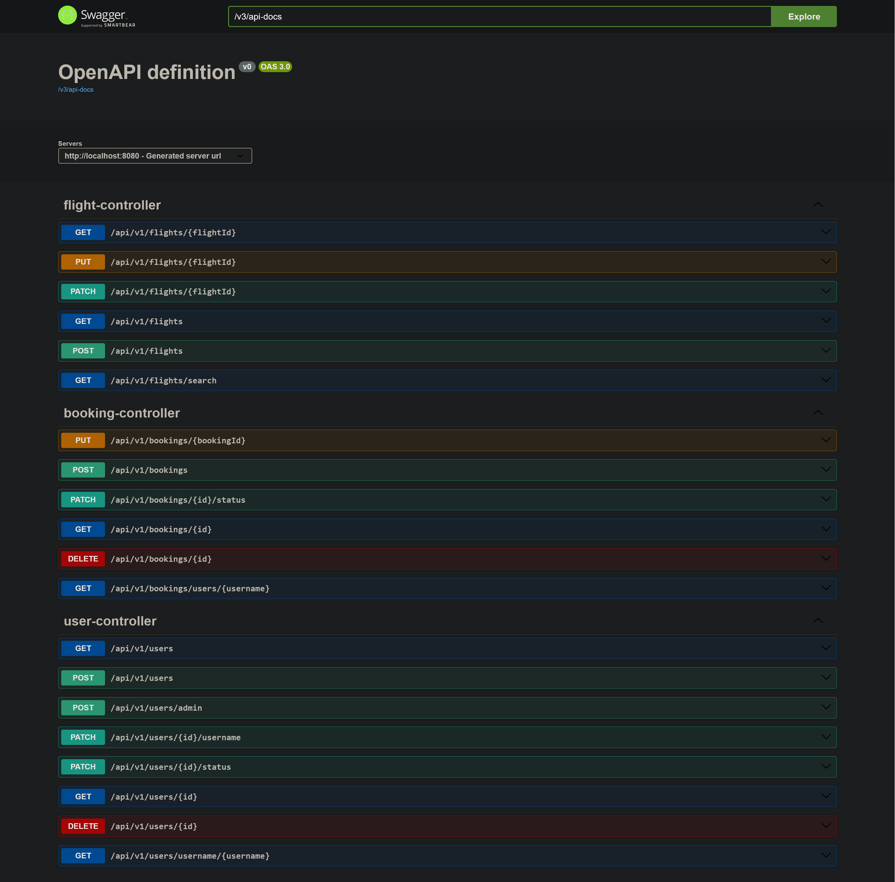

# Flight Booking System #

<pre>
Total test count: 54
Used:
    - Java 21, Gradle
    - Spring Boot -> Web, AOP, Data JPA, Test, Validation
    - Postgres db
    - Liquibase as db migration tool
    - DockerFile, Docker Compose
    - Project Lombok
    - MapStruct
    - Spring Fox (Swagger)
    - Slf4j
    - SonarQube
    - Test admin: id: 1; username: `admin@gmail.com`; password: `Admin@2005`; status: `ACTIVE`
    - Test user #1: 2; username: `anar@gmail.com`; status: `ACTIVE`
    - Test user #2: 3; username: `adil@gmail.com`; status: `ACTIVE`
    - Test user #3: 4; username: `ayten@gmail.com`; status: `ACTIVE`
    - Test user #4: 5; username: `joshgun@gmail.com`; status: `ACTIVE`
</pre>

## Getting Started ##

Open terminal and:

- `git clone https://github.com/adiliso/ms-booking.git` - clone the project
- `cd ./ms-booking` - change directory into the project

For Linux & macOS users only:

- `chmod +x start` - add permission to `start` file to be able to run command inside it
- `chmod +x stop` - add permission to `stop` file to be able to run command inside it
- `chmod +x gradlew`  - add permission to `gradlew` file to be able to clean and build

Then, start or stop the app:

- `./start` - start app
- `./stop`  - stop app

## Swagger Docs: ##

```
http://localhost:8080/swagger-ui/index.html#
```

### Ms-Booking Rest API ###

